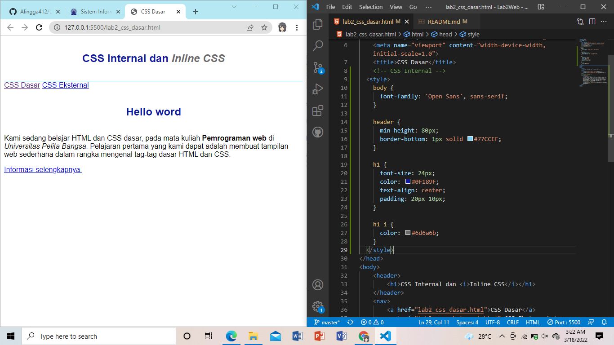
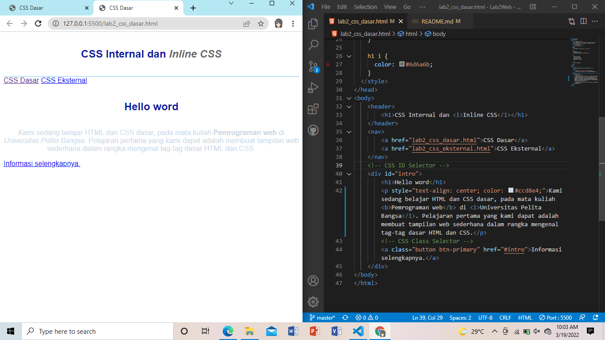
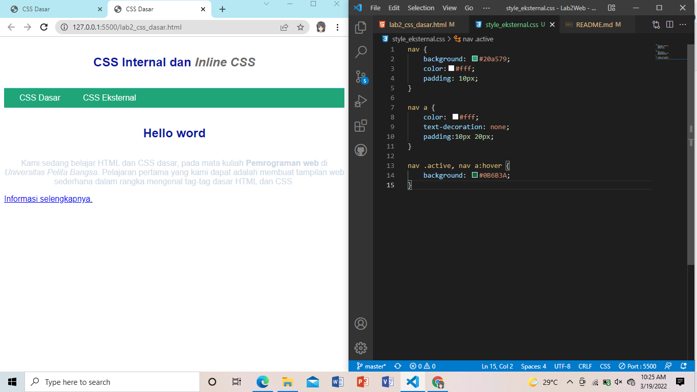
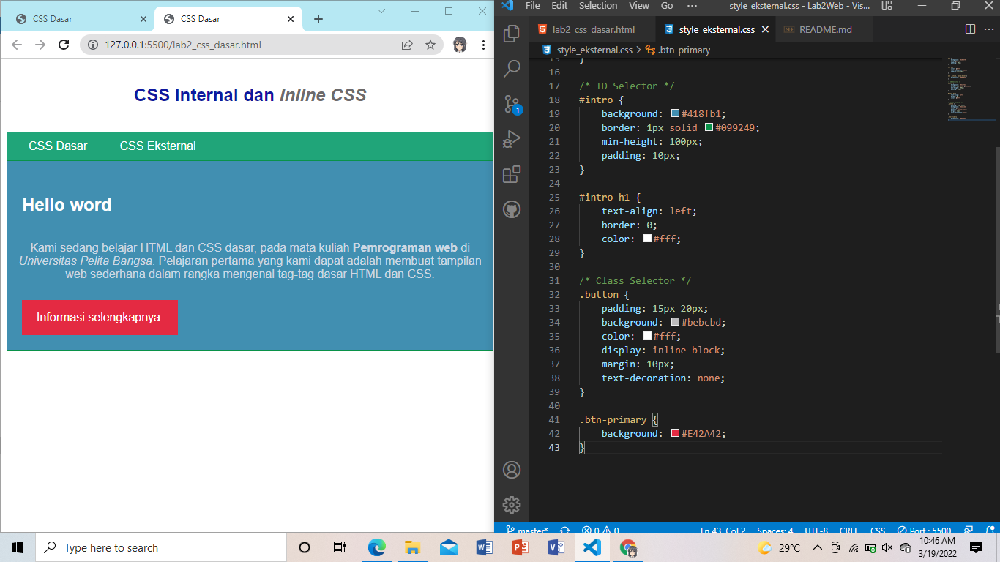

## Langkah 1
## Profil
| # | Biodata |
| -------- | --- |
| **Nama** | Alingga Reandito |
| **NIM** | 312010276 |
| **Kelas** | TI.20.A.2 |
| **Mata Kuliah** | Pemrograman Web |

1. Membuat Dokumen HTML Dengan nama `lab2_css_dasar.html`.

2. Lalu buat struktur dasar HTML.
```html
<!DOCTYPE html>
<html lang="en">
<head>
    <meta charset="UTF-8">
    <meta http-equiv="X-UA-Compatible" content="IE=edge">
    <meta name="viewport" content="width=device-width, initial-scale=1.0">
    <title>CSS Dasar</title>
</head>
<body>
    <header>
        <h1>CSS Internal dan <i>Inline CSS</i></h1>
    </header>
    <nav>
        <a href="lab2_css_dasar.html">CSS Dasar</a>
        <a href="lab2_css_eksternal.html">CSS Eksternal</a>
    </nav>
    <!-- CSS ID Selector -->
    <div id="intro">
        <h1>Hello word</h1>
        <p>Kami sedang belajar HTML dan CSS dasar, pada mata kuliah <b>Pemrograman web</b> di <i>Universitas Pelita Bangsa</i>. Pelajaran pertama yang kami dapat adalah membuat tampilan web sederhana dalam rangka mengenal tag-tag dasar HTML dan CSS.</p>
        <!-- CSS Class Selector -->
        <a class="button btn-primary" href="#intro">Informasi selengkapnya.</a>
    </div>
</body>
</html>
```

Maka hasilnya akan seperti berikut.

 
## Langkah 2 `Mendeklarasikan CSS internal`
1. Tambahkan kode berikut kedalam head HTML.

```html
<!-- CSS Internal -->
  <style>
    body {
      font-family: 'Open Sans', sans-serif;
    }

    header {
      min-height: 80px;
      border-bottom: 1px solid #77CCEF;
    }

    h1 {
      font-size: 24px;
      color: #0F189F;
      text-align: center;
      padding: 20px 10px;
    }

    h1 i {
      color: #6d6a6b;
    }
  </style>  
  ```

  2. Maka hasilnya akan seperti berikut.

  

  ## Langkah 3 `Menambahkan Inline CSS`
  1. Tambahkan kode berikut kedalam tag `<p>`.
  ```html
<p style="text-align: center; color: #ccd8e4;">
```

2. Maka hasilnya akan seperti berikut.


## Langkah 4 `membuat CSS Eksternal`
1. Buat file baru bernama `style_eksternal.css`.
2. Deklarasikan kode berikut ke dalamnya.
```css
nav {
  background: #20A759;
  color:#fff;
  padding: 10px;
}

nav a {
  color: #fff;
  text-decoration: none;
  padding:10px 20px;
}

nav .active, nav a:hover {
  background: #0B6B3A;
}
```

3. Sisipkan tag `<link>` untuk menghubungkan antara file HTML dengan file CSS dibagian `<head>`.

```html
<!-- menyisipkan css eksternal -->
<link rel="stylesheet" href="style_eksternal.css" type="text/css">
```
> Apabila tidak menambahkan tag ini maka html tidak akan mendapatkan stylenya/tidak valid.
4. Maka hasilnya akan seperti berikut.


## Langkah 5 `Menambahkan CSS Selector`
1. Tambahkan Selector menggunakan  _ID_ dan _Class_ pada file `style_eksternal.css`.
```css
/* ID Selector */

#intro {
    background: #418fb1;
    border: 1px solid #099249;
    min-height: 100px;
    padding: 10px;
}

#intro h1 {
    text-align: left;
    border: 0;
    color: #fff;
}

/* Class Selector */
.button {
    padding: 15px 20px;
    background: #bebcbd;
    color: #fff;
    display: inline-block;
    margin: 10px;
    text-decoration: none;
}

.btn-primary {
    background: #E42A42;
}
```

2. Maka hasilnya akan seperti berikut.


> ### Jadi cantik bukan?

# Pertanyaan
1. Lakukan eksperimen dengan mengubah